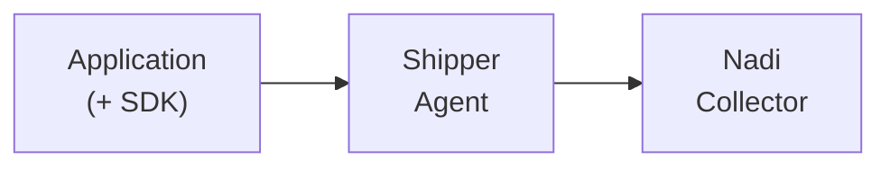

# Introduction

Welcome to the documentation of Nadi, a powerful error monitoring and exception tracking tool designed to help developers identify, track, and resolve software bugs and exceptions efficiently. Nadi combines the best features of Bugsnag and Sentry, two popular error monitoring platforms, to provide a comprehensive solution for managing and debugging errors in your applications.

## Why Nadi?

Bugsnag and Sentry are both renowned for their exceptional error monitoring capabilities. However, Nadi takes it a step further by integrating the strengths of these platforms into a unified tool. With Nadi, you no longer have to choose between the benefits offered by Bugsnag and Sentry. Instead, you can leverage a consolidated solution that encompasses the best features of both platforms, enabling you to streamline your error monitoring workflow.

## Key Features

| Feature                  | Description                                                                                         |
|--------------------------|-----------------------------------------------------------------------------------------------------|
| Error Monitoring         | Capture, collect, and analyze errors, exceptions, and crashes within your application.               |
| Real-time Alerts         | Receive instant alerts via email, Slack, or other channels to respond promptly to critical errors.    |
| Error Aggregation        | Intelligently group similar errors to identify patterns and prioritize bug fixes effectively.        |
| Error Context and Metadata | Access contextual information and metadata such as stack traces, request data, and user information. |
| Integrations and Collaboration | Seamlessly integrate with popular development tools and collaborate with your team effectively.  |
| Release Tracking *        | Associate errors with specific code releases to track issue progression across different versions.    |
| Performance Monitoring *  | Optional performance monitoring to track application metrics and identify performance bottlenecks.   |

<small>\* Incoming features</small>

## Getting Started

To get started with Nadi, follow the [installation](/1.0/installation.html) guide provided in this documentation. You'll find step-by-step instructions on how to integrate Nadi with your application and set up error monitoring and exception tracking.

## The Architecture

The following diagram show the workflow of how Nadi works.

1. The `Application` that installed with Nadi's Client will capture events and store it to the log files.
2. An agent, Shipper which installed in the `Application` will read through the log files and send the logs to Nadi Collector.

Using Nadi, you will need to install:

1. Install the Nadi's Client to Your Application
2. Install the Nadi Shipper, which will be responsible for sending the logs to Nadi Collector

The following are the components involved in Nadi:

| Component                  | Description                                                                 |
|----------------------------|-----------------------------------------------------------------------------|
| Nadi Client              | Responsible for capture events to be monitor such as Exception, Slow Query. |
| Nadi Shipper               | Responsible to read logs that not yet send to the Nadi Collector            |
| Nadi Collector             | Responsible to receive logs from Shipper and store it in the database       |

## Nadi's Client

Following are the support Runtime & Framework in Nadi:

| Runtime | Version | Framework  |
|---------|---------|------------|
| PHP     | > 7     | Laravel 5+ |

Following are the incoming Runtime & Framework that will be support in Nadi:

| Runtime | Framework   |
|---------|-------------|
| PHP     | CakePHP     |
|         | Yii         |
|         | Symfony     |
|         | CodeIgniter |
|         | WordPress   |
| Python  | Django      |
| Go      | Gofiber     |
| .NET    |             |
| Java    | Liferay     |
|         | Springboot  |
| NodeJs  | NextJs      |
|         | NuxtJs      |

For contribution / collaboration, do contact <a href="mailto:tech@nadi.pro?subject=Working with Nadi&body=Hi, I would like to participate in the contribution in Nadi. Following are my details: ">tech@nadi.pro</a>
