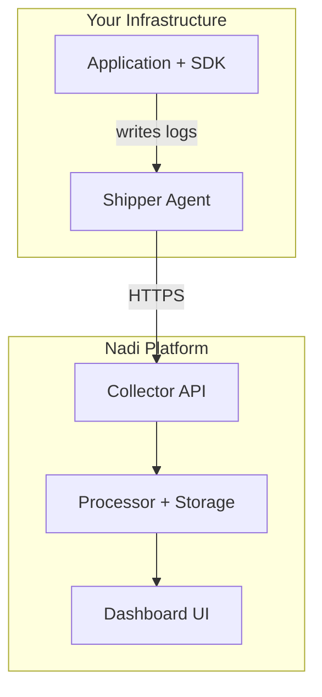
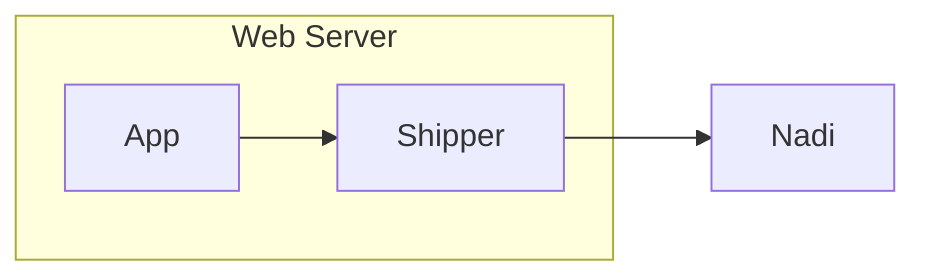
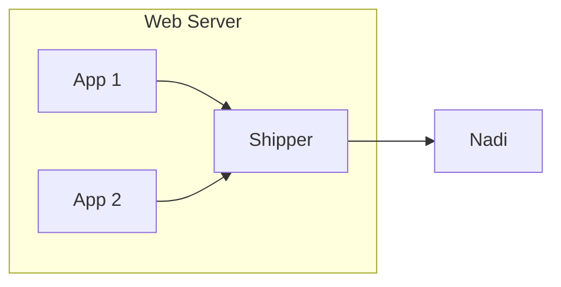
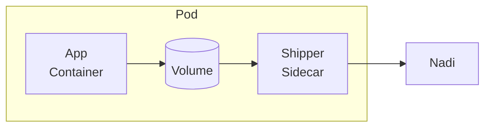

# Architecture

Understanding how Nadi works helps you get the most out of error monitoring and troubleshoot issues effectively.

## System Overview

Nadi uses a three-component architecture designed for reliability and minimal performance impact:



## Components

### 1. SDK (Client)

The SDK integrates directly into your application code. It's responsible for:

- **Capturing errors** - Exceptions, errors, and crashes
- **Collecting context** - Request data, user info, environment
- **Writing to log files** - JSON-formatted events stored locally
- **Sampling** - Controlling what percentage of events are captured

**Available SDKs:**

| SDK | Package | Use Case |
|-----|---------|----------|
| Laravel | `nadi-pro/nadi-laravel` | Laravel applications |
| PHP | `nadi-pro/nadi-php` | Any PHP application |
| WordPress | `nadi-pro/nadi-wordpress` | WordPress sites |
| JavaScript | `@nadi-pro/browser` | Browser applications |

::: tip Why Log Files?
Writing to local log files is fast and doesn't block your application. It also provides resilience - if the network is unavailable, events are queued locally until Shipper can send them.
:::

### 2. Shipper (Agent)

Shipper is a lightweight Go binary that runs on your server. It:

- **Monitors log files** - Watches for new events
- **Batches requests** - Efficient network usage
- **Handles retries** - Automatic retry on failure
- **Tracks progress** - Knows what's been sent

**Key Features:**

- Minimal resource usage (~10MB RAM)
- Supports multiple applications on one server
- Configurable via YAML
- Works with systemd, supervisord, or as a standalone process

### 3. Collector (Platform)

The Nadi platform receives, processes, and stores error data:

- **Ingestion** - High-throughput event collection
- **Processing** - Error fingerprinting and grouping
- **Storage** - Time-series data with retention policies
- **Analysis** - Trends, patterns, and insights
- **Alerting** - Notifications when issues occur

## Data Flow

### 1. Error Capture

When an error occurs in your application:

```php
// Your code throws an exception
throw new \Exception('Something went wrong');

// The SDK captures it automatically (Laravel)
// Or you capture it manually (PHP)
$client->captureException($exception);
```

### 2. Event Creation

The SDK creates a structured event:

```json
{
  "type": "exception",
  "level": "error",
  "message": "Something went wrong",
  "exception": {
    "type": "Exception",
    "message": "Something went wrong",
    "stacktrace": [...]
  },
  "context": {
    "request": {...},
    "user": {...},
    "tags": {...}
  },
  "timestamp": "2024-01-15T10:30:00Z"
}
```

### 3. Local Storage

Events are written to log files:

```
/var/log/nadi/
├── nadi-2024-01-15.log    # Today's events
├── nadi-2024-01-14.log    # Yesterday's events
└── tracker.json           # Shipper's progress tracker
```

### 4. Shipping

Shipper reads new events and sends them to Nadi:

```yaml
# Shipper reads from storage path
storage: /var/log/nadi

# Sends to Nadi API
endpoint: https://nadi.pro/api/
```

### 5. Processing

Nadi processes the event:

1. **Authentication** - Validates API key and app key
2. **Enrichment** - Adds server-side data (GeoIP, etc.)
3. **Fingerprinting** - Generates unique error signature
4. **Grouping** - Matches to existing issues or creates new
5. **Storage** - Saves to database
6. **Alerting** - Triggers notifications if configured

## Security

### Data in Transit

- All communication uses HTTPS/TLS
- API keys authenticate all requests
- Application keys isolate data per project

### Data at Rest

- Events stored encrypted
- Configurable retention policies
- Data isolation between teams

### Sensitive Data

- SDK can scrub sensitive fields
- Request body filtering available
- Environment variable masking

## Scalability

### Application Side

- Async log writing (non-blocking)
- Sampling reduces volume
- Buffering handles traffic spikes

### Shipper Side

- Batched requests (efficient network usage)
- Configurable batch size and intervals
- Multiple Shippers for high-volume apps

### Platform Side

- Horizontal scaling
- Rate limiting per application
- Automatic load balancing

## Deployment Patterns

### Single Server



### Multiple Applications



### Kubernetes



## Next Steps

- [Authentication](/guide/authentication) - Understand API and App keys
- [Shipper Configuration](/shipper/configuration) - Configure the Shipper agent
- [SDK Documentation](/sdks/) - Integrate with your application
