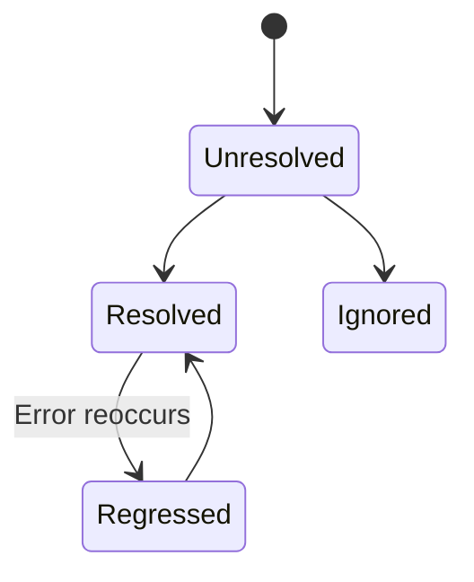

# Issues

Issues represent unique errors that occur in your application. Nadi automatically groups similar errors together.

## Issue Grouping

Nadi groups errors based on:

1. **Exception type** - The class/type of the error
2. **Error message** - Normalized message (dynamic values replaced)
3. **Stack trace** - Location where the error occurred

### Example Grouping

These errors would be grouped together:

```
TypeError: Cannot read property 'name' of undefined
  at getUser (UserService.js:45:12)

TypeError: Cannot read property 'name' of undefined
  at getUser (UserService.js:45:12)
```

These would be separate issues:

```
TypeError: Cannot read property 'name' of undefined
  at getUser (UserService.js:45:12)

TypeError: Cannot read property 'email' of undefined
  at getUser (UserService.js:48:12)
```

## Issue Status

| Status | Description |
|--------|-------------|
| **Unresolved** | Active issue needing attention |
| **Resolved** | Marked as fixed |
| **Ignored** | Won't be tracked or alerted |
| **Regressed** | Resolved but reoccurred |

### Status Workflow



### Resolving Issues

1. Click the issue to open details
2. Click **Resolve** button
3. Optionally add a note (commit hash, PR link)

When an issue is resolved:
- It moves out of the default view
- If it reoccurs, status changes to **Regressed**
- You'll be alerted about regressions

### Ignoring Issues

Ignore issues you don't want to track:

1. Click the issue
2. Click **Ignore** button
3. Choose ignore duration:
   - Until resolved
   - For 24 hours
   - For 7 days
   - Forever

Ignored issues:
- Don't trigger alerts
- Don't appear in default view
- Still capture events (for record)

## Issue Details

Click an issue to see:

### Error Information

- **Type** - Exception class/type
- **Message** - Full error message
- **First seen** - When first captured
- **Last seen** - Most recent occurrence
- **Event count** - Total occurrences
- **User count** - Affected users

### Stack Trace

Full stack trace with:
- File paths (clickable if source maps uploaded)
- Line and column numbers
- Code context (surrounding lines)
- In-app vs vendor code highlighting

### Tags

Searchable metadata:
- Environment
- Release version
- Server name
- Custom tags from SDK

### Breadcrumbs

Timeline of events before the error:
- User actions (clicks, navigation)
- API requests
- Console output
- State changes

### User Information

If captured:
- User ID
- Email
- Name
- IP address (if enabled)

### Request Data

For web requests:
- URL
- HTTP method
- Headers
- Query parameters
- Request body (filtered)

## Issue Actions

### Assign

Assign to team members:

1. Click **Assign**
2. Select team member
3. They'll receive notification

### Link to External Tools

Link issues to external tracking:
- Jira ticket
- GitHub issue
- Linear issue
- Custom URL

### Add Notes

Add internal notes:
- Investigation findings
- Workarounds
- Related issues

## Filtering Issues

### Quick Filters

- **Unresolved** - Active issues
- **My Issues** - Assigned to you
- **Bookmarked** - Starred issues

### Advanced Filters

Filter by:
- Status (unresolved, resolved, ignored)
- Assignee
- Environment
- Release
- Date range
- Tag values
- Has linked issue

### Search Syntax

```
# By error message
message:"database connection"

# By file path
file:UserService.php

# By tag
tag:environment:production

# By user
user:email@example.com

# Combine filters
message:timeout AND tag:environment:production
```

## Bulk Operations

Select multiple issues to:

1. **Resolve all** - Mark selected as resolved
2. **Ignore all** - Mark selected as ignored
3. **Assign all** - Assign to team member
4. **Merge** - Combine duplicate issues

### Merge Issues

If you have duplicate issues that should be one:

1. Select the issues
2. Click **Merge**
3. Choose the primary issue
4. Confirm merge

Events from merged issues appear under the primary issue.

## Issue Subscriptions

Subscribe to specific issues for updates:

1. Open the issue
2. Click **Subscribe**
3. Choose notification preference:
   - All events
   - First occurrence per hour
   - Status changes only

## Next Steps

- [Error Details](/platform/dashboard/error-details) - Deep dive into error data
- [Trends](/platform/dashboard/trends) - Analyze patterns
