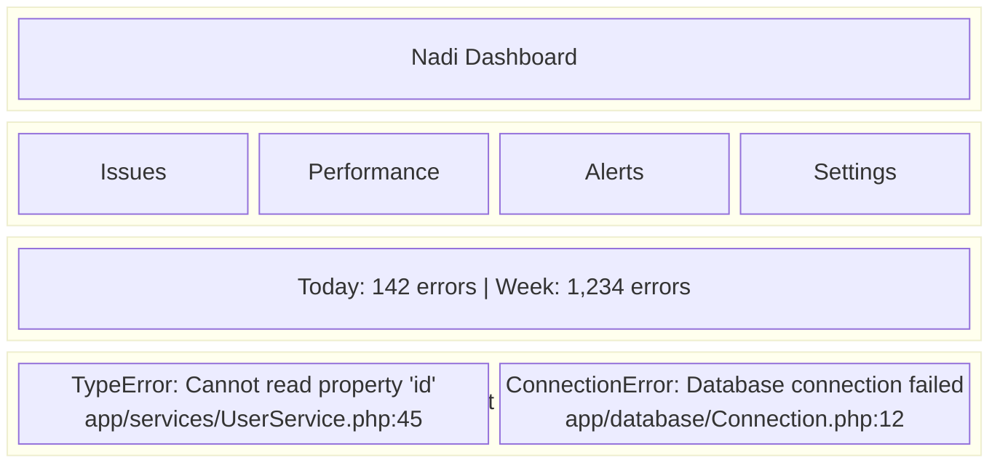

# Platform Overview

The Nadi platform provides a comprehensive dashboard for monitoring, analyzing, and responding to errors across your applications.

## Key Features

| Feature | Description |
|---------|-------------|
| **Error Dashboard** | View, filter, and manage errors across projects |
| **Real User Monitoring** | Track Web Vitals and user experience |
| **Alerts** | Get notified when issues occur |
| **Team Management** | Collaborate with your team |
| **Integrations** | Connect to Slack, Teams, and more |

## Getting Started

1. **Create an Account** - Sign up at [nadi.pro](https://nadi.pro)
2. **Create a Project** - Set up your first application
3. **Install an SDK** - Add Nadi to your application
4. **Configure Shipper** - Deploy the log shipping agent
5. **View Errors** - Start seeing errors in the dashboard

## Dashboard Overview

## Platform Sections

### Issues

View and manage errors:

- **Issue List** - All captured errors with aggregation
- **Issue Details** - Full stack trace, context, and history
- **Issue Actions** - Resolve, ignore, assign to team members

[Learn more →](/platform/dashboard/issues)

### Performance (RUM)

Monitor real user experience:

- **Web Vitals** - LCP, FID, CLS metrics
- **Sessions** - User session tracking
- **Performance** - Page load and response times

[Learn more →](/platform/rum/)

### Alerts

Get notified about issues:

- **Alert Rules** - Configure when to be notified
- **Channels** - Slack, Teams, Telegram, email, webhooks
- **Schedules** - Time-based alert routing

[Learn more →](/platform/alerts/)

### Settings

Manage your account and projects:

- **Teams** - Invite members, manage roles
- **Projects** - Configure applications
- **API Keys** - Manage credentials
- **Integrations** - Connect third-party tools

[Learn more →](/platform/teams/)

## Next Steps

- [Dashboard](/platform/dashboard/) - Learn the dashboard
- [Real User Monitoring](/platform/rum/) - Monitor performance
- [Alerts](/platform/alerts/) - Set up notifications
- [Team Management](/platform/teams/) - Collaborate with your team
