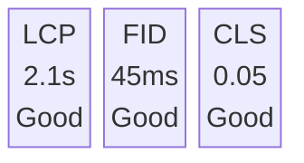

# Real User Monitoring

Monitor real user experience with performance metrics and session data.

## Overview

Real User Monitoring (RUM) captures performance data from actual users, providing insights into:

- Page load times
- Core Web Vitals
- User sessions
- Geographic performance
- Device/browser performance

## Getting Started

### Enable RUM

RUM is enabled in the JavaScript SDK:

```javascript
import { init } from '@nadi-pro/browser'

init({
  appKey: 'your-app-key',
  enableWebVitals: true,
  enableSessionReplay: false, // Optional
})
```

### View RUM Data

Navigate to **Performance** in the dashboard to see:

- Web Vitals overview
- Page performance
- User sessions
- Geographic data

## Dashboard Overview



**Page Performance**

| Page | LCP | Status | Views |
|------|-----|--------|-------|
| / | 1.8s | Good | 12,345 |
| /products | 2.4s | Moderate | 8,234 |
| /checkout | 3.1s | Poor | 2,123 |

## Metrics

### Core Web Vitals

| Metric | Good | Moderate | Poor |
|--------|------|----------|------|
| **LCP** | ≤ 2.5s | 2.5-4s | > 4s |
| **FID** | ≤ 100ms | 100-300ms | > 300ms |
| **CLS** | ≤ 0.1 | 0.1-0.25 | > 0.25 |

### Additional Metrics

| Metric | Description |
|--------|-------------|
| **FCP** | First Contentful Paint |
| **TTFB** | Time to First Byte |
| **INP** | Interaction to Next Paint |

## Segmentation

### By Page

View metrics per page:

- Identify slow pages
- Compare page types
- Track specific routes

### By Device

Segment by device type:

- Desktop
- Mobile
- Tablet

### By Browser

Compare browsers:

- Chrome
- Safari
- Firefox
- Edge

### By Geography

See regional performance:

- Country-level metrics
- Latency by region
- CDN effectiveness

### By Connection

Filter by connection type:

- 4G
- 3G
- WiFi
- Offline

## Alerts

Set alerts for performance regressions:

1. Go to **Alerts** → **New Rule**
2. Select **Performance** trigger
3. Configure threshold (e.g., LCP > 3s)
4. Set notification channel

## Next Steps

- [Web Vitals](/platform/rum/web-vitals) - Deep dive into metrics
- [Sessions](/platform/rum/sessions) - User session tracking
- [Performance](/platform/rum/performance) - Page performance
