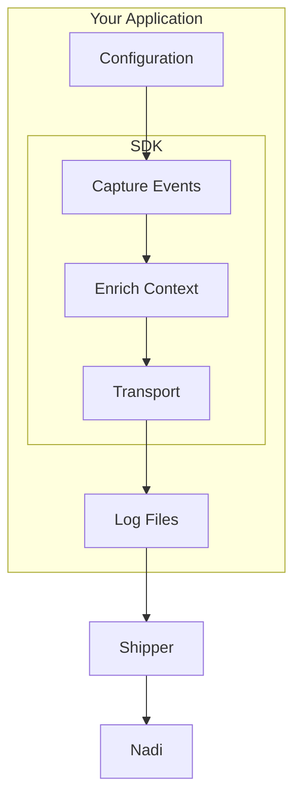

# SDK Overview

Nadi provides official SDKs for multiple platforms, making it easy to integrate error monitoring into your applications.

## Available SDKs

| SDK | Package | Requirements | Status |
|-----|---------|--------------|--------|
| [Laravel](/sdks/laravel/) | `nadi-pro/nadi-laravel` | PHP 8.1+, Laravel 9+ | Stable |
| [PHP](/sdks/php/) | `nadi-pro/nadi-php` | PHP 8.1+ | Stable |
| [WordPress](/sdks/wordpress/) | `nadi-pro/nadi-wordpress` | PHP 8.1+, WP 5.0+ | Stable |
| [JavaScript](/sdks/javascript/) | `@nadi-pro/browser` | Modern browsers | Stable |

## Choosing an SDK

### Laravel Applications

Use the **Laravel SDK** for Laravel applications. It provides:

- Automatic exception handling integration
- Laravel-specific context (routes, middleware, queues)
- Artisan commands for setup and testing
- Blade error pages integration
- Queue job monitoring

```bash
composer require nadi-pro/nadi-laravel
php artisan nadi:install
```

[Laravel SDK Documentation →](/sdks/laravel/)

### PHP Applications

Use the **PHP SDK** for any PHP application:

- Framework-agnostic design
- Multiple transporter options (file, HTTP)
- Flexible sampling strategies
- PSR-3 logger integration

```bash
composer require nadi-pro/nadi-php
```

[PHP SDK Documentation →](/sdks/php/)

### WordPress Sites

Use the **WordPress Plugin** for WordPress sites:

- One-click installation
- Admin UI for configuration
- WooCommerce integration <VersionBadge type="coming-soon">Coming Soon</VersionBadge>
- WordPress-specific context

[WordPress SDK Documentation →](/sdks/wordpress/)

### Browser Applications

Use the **JavaScript SDK** for browser applications:

- Automatic error capturing
- Web Vitals monitoring
- Breadcrumb tracking
- Session replay <VersionBadge type="coming-soon">Coming Soon</VersionBadge>
- Framework integrations (React, Vue, Angular, Next.js) <VersionBadge type="coming-soon">Coming Soon</VersionBadge>

```bash
npm install @nadi-pro/browser
```

[JavaScript SDK Documentation →](/sdks/javascript/)

## Core Concepts

All Nadi SDKs share common concepts:

### Events

Events are the primary data structure in Nadi. Types include:

- **Exceptions** - Captured errors and exceptions
- **Messages** - Manual log messages
- **Breadcrumbs** - User actions and navigation
- **Performance** - Web Vitals and timing data

### Context

Context enriches events with additional information:

- **User** - Current user details
- **Tags** - Key-value pairs for filtering
- **Extra** - Additional arbitrary data
- **Request** - HTTP request details

### Sampling

Sampling controls what percentage of events are captured:

- **Fixed Rate** - Capture X% of all events
- **Dynamic Rate** - Adjust based on load
- **Interval** - Capture at time intervals
- **Peak Load** - Increase during high traffic

### Transporters

Transporters determine how events are sent:

- **File** - Write to local log files (recommended)
- **HTTP** - Send directly to Nadi API

::: tip Recommended Setup
Use the file transporter with Shipper for best reliability. This approach handles network issues gracefully and doesn't block your application.
:::

## SDK Architecture



## Next Steps

Choose the SDK for your platform:

- [Laravel SDK](/sdks/laravel/) - Full-featured Laravel integration
- [PHP SDK](/sdks/php/) - Framework-agnostic PHP client
- [JavaScript SDK](/sdks/javascript/) - Browser error tracking
- [WordPress SDK](/sdks/wordpress/) - WordPress plugin
